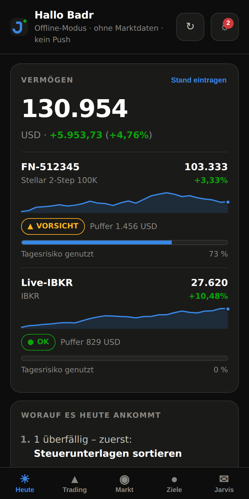
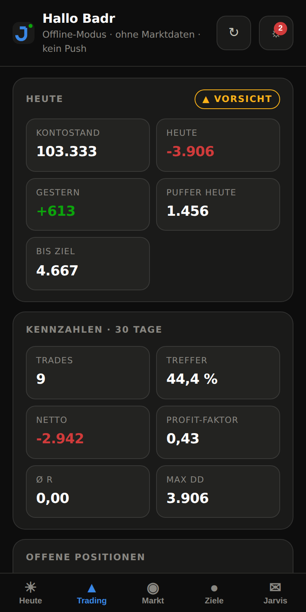
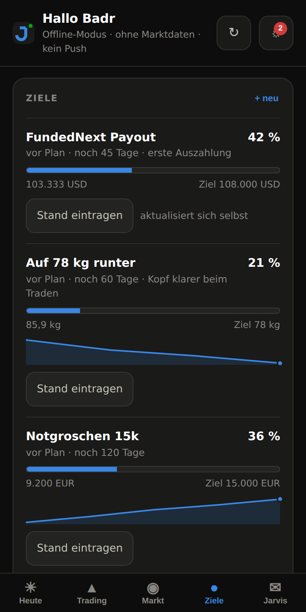
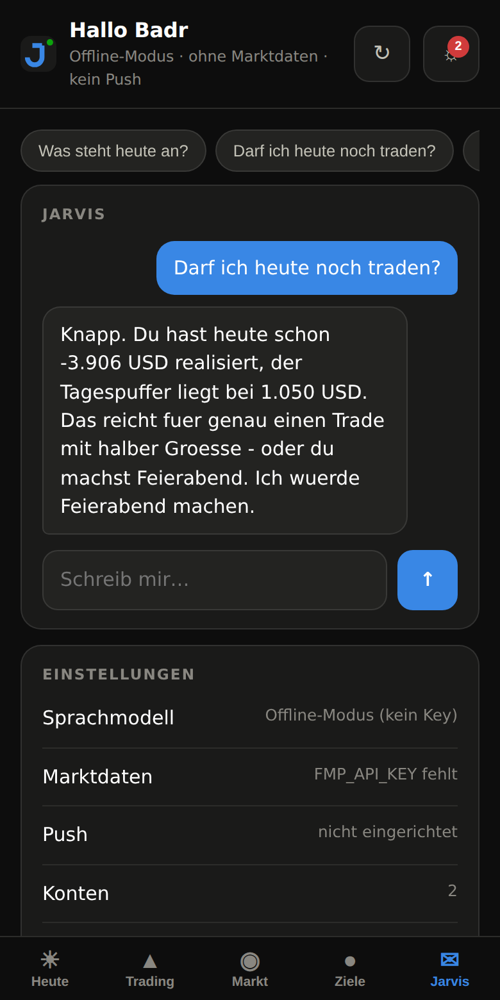

# Jarvis

Ein persönlicher Assistent, der dein Leben ordnet, dein Trading trackt, Märkte und
Wirtschaftsdaten liest — und morgens sagt, worauf es heute ankommt. Er redet mit dir,
merkt sich, wer du bist, und verhält sich wie ein Freund, nicht wie ein Formular.
**Als App auf deinem Handy**, mit Push, wenn es wichtig wird.

Inspiriert von [OpenJarvis](https://github.com/open-jarvis/OpenJarvis): **local-first**.
Deine Daten liegen in einer SQLite-Datei auf deinem Rechner. Cloud-Dienste werden nur
aufgerufen, wenn du sie einschaltest.

```bash
jarvis app --phone      # App im WLAN freigeben → Handy → "Zum Startbildschirm"
```

```
$ jarvis brief

# Guten Morgen, Badr
*Montag, 21.09.2026*

## Worauf es heute ankommt
1. 2 überfällige Aufgabe(n) - zuerst: Steuerunterlagen sortieren
2. Trading: nur noch 840.00 USD Spielraum.
3. News-Risiko: Non-Farm Payrolls (US) um 14:30

## Trading
- Konto **FN-100k**: 98.420,00 USD
- Heute: 0,00 USD | Gestern: -1.580,00 USD
- Wachhund: **VORSICHT** - Spielraum 840.00 USD (Tageslimit 4.921, bis Ziel 9.580)
- 7 Tage: 8 Trades, -1.240 USD, 37,5% Treffer, PF 0.71

## Märkte
- ^ **XAUUSD** 2351.40 (+0.42%)
- v **EURUSD** 1.0834 (-0.18%)
```

---

## Was Jarvis kann

| Bereich | Was er macht |
|---|---|
| **Auf dem Handy** | Installierbare App (PWA): Heute, Trading, Markt, Ziele, Chat — dunkel, schnell, offline lesbar |
| **Leben ordnen** | Aufgaben mit „morgen"/„freitag"-Erkennung, Gewohnheiten mit Streaks, Notizen, Termine, Stimmungstagebuch |
| **Ziele verfolgen** | Messbare Ziele mit Deadline, Tempo-Rechnung („vor Plan"/„hinter Plan") und automatischem Fortschritt aus dem Konto |
| **Kontostände** | FundedNext-Abgleich alle 30 Minuten, Verlaufskurve, Portfolio über alle Konten |
| **Trading tracken** | Journal mit R-Multiple, Konten (auch Prop-Firm), CSV-Import aus MT4/MT5/cTrader, Kennzahlen, Leck-Analyse |
| **Risiko bewachen** | Positionsgrößen-Rechner, Prop-Firm-Wachhund (Tages- und Gesamtlimit), CRV-Check |
| **Markt lesen** | Kurse, SMA/RSI/ATR, Trend-Bias, Support/Resistance, Watchlist-Scan |
| **Wirtschaft** | Wirtschaftskalender (NFP, CPI, FOMC …), Makro-Dashboard, Nachrichten |
| **Melden** | Push per ntfy oder Telegram: Briefing, Risikolimit erreicht, Ziel hinter Plan, Zahlen in 30 Minuten |
| **Morgens briefen** | Ein Briefing als Text, HTML oder vorgelesen — automatisch zur festen Uhrzeit |
| **Reden** | Text-Chat, Sprachmodus mit Mikrofon und Stimme |
| **Sich erinnern** | Langzeitgedächtnis für Ziele, Regeln, Vorlieben — fließt in jede Antwort ein |

---

## Installation

Du brauchst nur **Python 3.10+**. Der Kern läuft ohne ein einziges Fremdpaket.

```bash
git clone https://github.com/Badr4391/Jarvis.git
cd Jarvis
pip install -e .              # oder: pip install -e ".[all]" für Extras

cp .env.example .env          # Keys eintragen (alles optional)
jarvis init                   # kurzer Einrichtungsdialog
jarvis doctor                 # zeigt, was läuft und was fehlt
```

Ohne Installation geht es auch:

```bash
PYTHONPATH=src python3 -m jarvis brief
```

---

## Erste Schritte

```bash
jarvis init                                   # Konto, Regeln, Gewohnheiten anlegen
jarvis app                                    # App auf http://127.0.0.1:8765
jarvis app --phone                            # … und aufs Handy im WLAN
jarvis brief --html                           # erstes Briefing, auch als HTML
jarvis chat "was steht heute an?"             # einmalige Frage
jarvis daemon                                 # alles Weitere läuft von allein
```

---

## Jarvis aufs Handy

Die App ist eine PWA — keine App-Store-Runde, keine Installation von Fremden,
alles läuft weiter auf deinem Rechner.

```bash
jarvis app --phone
```

Das gibt dir eine Adresse wie `http://192.168.1.42:8765/?token=xK3…` und erzeugt
automatisch ein Zugangstoken. Auf dem Handy:

1. Gleiches WLAN wie der Rechner
2. Adresse im Browser öffnen
3. **iPhone:** Teilen → „Zum Home-Bildschirm" · **Android:** Menü → „App installieren"

Danach startet Jarvis wie eine echte App — eigenes Icon, kein Browser-Rahmen,
und der letzte Stand ist auch ohne Verbindung lesbar.

<p>
  
  
  
  
</p>

**Fünf Bereiche:**

| Tab | Was drin ist |
|---|---|
| **Heute** | Vermögen über alle Konten, Verlaufskurve je Konto, Risiko-Ampel, die Rangliste „worauf es heute ankommt", Aufgaben und Gewohnheiten zum Abhaken, Briefing |
| **Trading** | Tagesstand, Risikopuffer, Kennzahlen über 30 Tage, offene Positionen, letzte Trades, wo du verdienst und wo du verlierst |
| **Markt** | Kurse deiner Watchlist, Wirtschaftstermine, Makro-Lage, Schlagzeilen |
| **Ziele** | Fortschrittsbalken, Tempo („vor Plan"), Verlauf, Stand eintragen |
| **Jarvis** | Chat mit Werkzeugzugriff, Schnellfragen, Einstellungen |

Die App aktualisiert sich von selbst: der Server schiebt Änderungen über eine
offene Verbindung nach, sobald ein Konto abgeglichen oder eine Warnung ausgelöst wird.

**Von unterwegs** (nicht nur im WLAN): [Tailscale](https://tailscale.com) auf
Rechner und Handy installieren, dann die Tailscale-IP statt der lokalen nehmen.
Den Server niemals ohne Token und ohne VPN ins offene Internet stellen — Jarvis
verweigert das auch aktiv.

---

## Immer auf dem Laufenden — Push

Damit dich Jarvis erreicht, wenn die App zu ist:

```bash
# Variante A: ntfy (am einfachsten, kein Konto)
# ntfy-App installieren, ein langes zufälliges Thema abonnieren
echo 'NTFY_TOPIC=jarvis-badr-x7k2m9q4' >> .env

# Variante B: Telegram
echo 'TELEGRAM_BOT_TOKEN=123456:ABC...' >> .env
jarvis notify --chat-id            # zeigt deine Chat-ID
echo 'TELEGRAM_CHAT_ID=987654321'  >> .env

jarvis notify --test               # kommt das an?
```

Was Jarvis von selbst meldet, sobald `jarvis daemon` läuft:

- **07:00** das Briefing, in Sprechfassung
- **alle 15 Min** (7–23 Uhr) Risikolimit erreicht, Ziel hinter Plan,
  wichtige Zahlen in unter 45 Minuten
- **21:00** Journal nachtragen, wenn Trades ohne Notiz offen sind
- **20:30** Tag abschließen

Gleiche Warnung wird nicht zweimal in vier Stunden geschickt.

---

## Kontostände automatisch

```bash
echo 'FUNDEDNEXT_TOKEN=dein-token' >> .env
jarvis sync
```

Das Token holst du dir aus dem eingeloggten FundedNext-Dashboard:
DevTools → Network → irgendein API-Aufruf → Header `Authorization: Bearer …`.
Es läuft regelmäßig ab; dann sagt dir Jarvis das im Klartext statt still falsche
Zahlen zu zeigen.

Jarvis übernimmt Stand, Equity, Phase und — wo die API sie liefert — die echten
Puffer des Anbieters. Der Daemon gleicht alle 30 Minuten ab und schreibt jeden
Tag einen Punkt in die Verlaufskurve.

Ohne Anbindung geht es genauso, nur von Hand:

```bash
jarvis account balance FN-100k 104250
```

---

## Die wichtigsten Befehle

### Leben

```bash
jarvis task add "Steuerunterlagen" --due freitag --priority hoch
jarvis task list
jarvis task done steuer                       # per Stichwort oder id
jarvis habit log Sport
jarvis note add "Idee: Backtest London Breakout" --tags trading
jarvis journal "guter Tag, fokussiert" --mood 8 --energy 7
jarvis review                                 # Abend-Rückblick
```

### Trading

```bash
jarvis account add --name FN-100k --balance 100000 --broker FundedNext \
                   --daily-loss 5 --total-loss 10 --target 8 --phase "Phase 1"

jarvis trade log EURUSD long --entry 1.0850 --exit 1.0910 --sl 1.0820 \
                --size 1 --pnl 600 --fees 7 --setup "London Breakout" --rating 4

jarvis trade log XAUUSD short --entry 2350 --sl 2358 --size 0.5 --open   # läuft noch
jarvis trade close 7 --exit 2335 --pnl 750 --rating 5

jarvis trade import mt5-export.csv --account FN-100k
jarvis trade status                           # Tagesstatus mit Wachhund
jarvis trade stats --days 30
jarvis trade review                           # wo verdienst du, wo verlierst du
```

### Risiko

```bash
jarvis risk size --symbol EURUSD --entry 1.0850 --sl 1.0820 --risk 0.5
jarvis risk check                             # darf ich heute noch handeln?
jarvis risk rr --entry 1.0850 --sl 1.0820 --tp 1.0940
```

Bei Paaren, deren Notierungswährung nicht deine Kontowährung ist (z. B. USDJPY auf einem
USD-Konto), `--rate` mitgeben: `--rate 0.0067` (= 1/150). Ohne Kurs sagt Jarvis es dir,
statt still falsch zu rechnen.

### Ziele

```bash
jarvis goal add "FundedNext Payout" --target 108000 --start 100000 --unit USD \
                --deadline 2026-12-15 --account FN-100k --metric balance \
                --why "erste Auszahlung"

jarvis goal add "Auf 78 kg" --target 78 --start 88 --unit kg --deadline 2026-12-01
jarvis goal progress "78 kg" 85.4
jarvis goal list
```

`--metric balance` heißt: das Ziel aktualisiert sich selbst aus dem Kontostand.
Ziele dürfen auch nach unten gehen (abnehmen, Schulden tilgen) — der Fortschritt
wird trotzdem richtig herum gerechnet.

Jarvis rechnet dir das Tempo aus: wie viel pro Tag noch nötig ist und ob du vor
oder hinter Plan liegst. Liegst du zurück, sagt er es dir — per Push.

### Markt und Wirtschaft

```bash
jarvis market quote EURUSD XAUUSD
jarvis market analyse XAUUSD                  # Trend, RSI, ATR, Levels
jarvis market scan                            # ganze Watchlist nach Trendstärke
jarvis market calendar --days 2               # nur wichtige Termine
jarvis market macro                           # Zinsen, Inflation, Arbeitsmarkt
jarvis market news --kind forex
jarvis market watch GBPJPY --remove BTCUSD
```

### Gedächtnis

```bash
jarvis memory remember ziel_2026 "FundedNext 100k auszahlen lassen" --category ziel
jarvis memory list
jarvis memory forget ziel_2026
```

---

## Sprachmodell einrichten

Jarvis läuft in drei Stufen:

| Modus | Was du brauchst | Was geht |
|---|---|---|
| **Offline** | nichts | Alle Befehle, Briefing, Journal, Analyse — nur kein freies Gespräch |
| **Lokal** | [Ollama](https://ollama.com) | Volles Gespräch, keine Daten verlassen den Rechner |
| **Cloud** | `ANTHROPIC_API_KEY` | Volles Gespräch, bestes Sprachverständnis |

```bash
# Cloud
echo 'ANTHROPIC_API_KEY=sk-ant-...' >> .env

# oder lokal
ollama pull qwen2.5:14b-instruct
echo 'JARVIS_LLM_PROVIDER=ollama'          >> .env
echo 'JARVIS_LLM_MODEL=qwen2.5:14b-instruct' >> .env
```

---

## Marktdaten einrichten

Kurse, Wirtschaftskalender und Nachrichten kommen von
[Financial Modeling Prep](https://financialmodelingprep.com) (kostenloser Tarif reicht zum Start):

```bash
echo 'FMP_API_KEY=dein-key' >> .env
```

Ohne Key bleiben die Marktblöcke einfach leer — nichts stürzt ab.

---

## Stimme einrichten

Sprachausgabe und -erkennung sind steckbar. Jarvis nimmt, was er findet.

**Linux**

```bash
sudo apt install espeak-ng alsa-utils         # einfachste Variante, sofort einsatzbereit
pip install faster-whisper                    # Spracherkennung
```

**Bessere deutsche Stimme (Piper)**

```bash
# piper installieren, dann ein deutsches Modell laden
echo 'PIPER_MODEL=/opt/piper/de_DE-thorsten-medium.onnx' >> .env
```

**macOS** — `say` ist schon da, für die Erkennung `pip install faster-whisper`.

Dann:

```bash
jarvis talk --check                           # zeigt, was gefunden wurde
jarvis talk                                   # Enter drücken, sprechen, zuhören
jarvis brief --speak                          # Briefing vorlesen lassen
```

---

## Automatisch am Morgen

```bash
jarvis daemon                                 # läuft im Vordergrund, prüft jede Minute
jarvis daemon --once                          # zeigt nur den Plan
```

Der Daemon erledigt fünf Dinge:

- **07:00** Kontostände holen, Ziele nachziehen, Briefing bauen (Markdown + HTML nach
  `data/briefings/`), als Push verschicken, auf Wunsch vorlesen
- **alle 30 Min** (7–23 Uhr) Kontostände abgleichen und in die Verlaufskurve schreiben
- **alle 15 Min** (7–23 Uhr) Warnungen prüfen: Risikolimit, Ziele hinter Plan,
  Wirtschaftstermine in unter 45 Minuten
- **20:30** Abend-Rückblick erzeugen
- **21:00** erinnern, wenn Trades ohne Journal-Notiz offen sind

Läuft die App währenddessen offen, bekommt sie jede Änderung sofort — ohne
Neuladen.

Als Dienst (Linux):

```bash
systemctl --user enable --now jarvis    # siehe scripts/jarvis.service
```

Uhrzeit und Abschnitte stellst du in `config/jarvis.yaml` ein.

---

## Konfiguration

Drei Ebenen, jede überschreibt die vorige: **Standardwerte → `config/jarvis.yaml` → `.env` / Umgebung**.

```bash
cp config/jarvis.example.yaml config/jarvis.yaml
```

Dort stellst du Name, Tonfall, Zeitzone, Watchlist, Risikoregeln, Briefing-Uhrzeit und
die Abschnitte des Briefings ein. YAML ist optional (braucht `PyYAML`) — ohne die Datei
gelten die Standardwerte plus `.env`.

---

## Wie es aufgebaut ist

```
src/jarvis/
├── cli.py              Kommandozeile (argparse, keine Abhängigkeit)
├── config.py           .env + YAML + Umgebung
├── core/
│   ├── assistant.py    Agentenschleife: Modell ruft Werkzeuge auf
│   ├── context.py      hält alle Dienste zusammen
│   ├── memory.py       Langzeitgedächtnis + Gesprächsverlauf
│   ├── persona.py      die Persönlichkeit (System-Prompt)
│   └── scheduler.py    tägliche Routinen + Intervall-Jobs
├── llm/                Anthropic | Ollama | Offline-Fallback
├── life/               Aufgaben, Gewohnheiten, Notizen, Termine, Tagebuch, Ziele
├── trading/            Journal, Kennzahlen, Risiko, CSV-Import
├── connectors/         Kontostände von außen (FundedNext), Abgleich, Portfolio
├── notify/             Push per ntfy und Telegram, Warnregeln
├── market/             FMP-Client, Indikatoren, Marktservice
├── briefing/           Briefing bauen und rendern (Markdown/HTML/Sprache)
├── voice/              TTS, STT, Aufnahme, Sprachschleife
├── skills/             47 Werkzeuge, die das Modell aufrufen kann
├── storage/            SQLite
└── api/
    ├── server.py       JSON-Schnittstelle + Ereignisstrom
    └── web/            die App: index.html, app.css, app.js, sw.js, manifest
```

Ein **Skill** ist eine normale Python-Funktion mit Dekorator. Sie ist sofort für die
Kommandozeile, das Modell und das Dashboard verfügbar:

```python
@skill(
    "habit_log",
    "Gewohnheit für heute abhaken.",
    properties={"name": {"type": "string"}},
    required=["name"],
    category="life",
)
def habit_log(ctx, name: str) -> dict:
    ctx.life.log_habit(name)
    return {"habit": name, "uebersicht": ctx.life.habit_overview()}
```

`jarvis skills` listet alle auf.

---

## Entwicklung

```bash
pip install -e ".[dev]"
pytest                       # 201 Tests, alles ohne Netz
python3 scripts/make_icons.py  # App-Icons neu erzeugen (nur bei Designänderung)
ruff check src tests
```

---

## Daten und Privatsphäre

- Alles liegt in `data/jarvis.db` (SQLite) auf deinem Rechner.
- `data/` ist in `.gitignore` — deine Trades landen nie im Repo.
- Ohne API-Keys verlässt kein Byte deinen Rechner.
- Mit `ANTHROPIC_API_KEY` gehen Gesprächsinhalte an Anthropic, mit `FMP_API_KEY` gehen
  Symbolnamen an FMP. Wer das nicht will: Ollama nutzen und Marktdaten weglassen.
- Push-Meldungen enthalten Kontozahlen. Bei ntfy kann jeder mitlesen, der das Thema
  kennt — nimm einen langen zufälligen Namen oder einen eigenen ntfy-Server.
- Die App im Netz freizugeben verlangt ein Token. Ohne Token startet Jarvis
  nicht auf `0.0.0.0` — das ist Absicht, kein Fehler.
- Sichern heißt: `data/jarvis.db` kopieren. Mehr ist es nicht.

---

## Wichtiger Hinweis

Jarvis gibt **keine Anlageberatung**. Die Marktanalyse ist Statistik über vergangene
Kurse, kein Signal und keine Prognose. Der Risiko-Wachhund ersetzt keine Disziplin —
er erinnert dich nur an deine eigenen Regeln. Handeln tust du, auf eigenes Risiko.

## Lizenz

MIT
